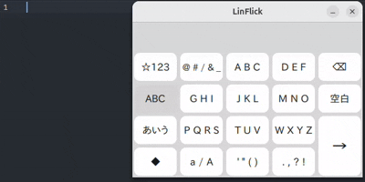
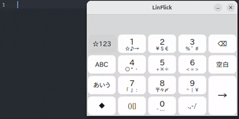

# LinFlick

LinFlick is a lightweight flick-input virtual keyboard for Linux.

Existing on-screen keyboards often occupy a large portion of the screen and are not always intuitive to use, especially when entering text primarily with a mouse instead of a physical keyboard. To address this issue, LinFlick adopts a flick-input interface that is familiar to many Japanese users, enabling efficient text entry with a compact on-screen layout.

The current version (v0.1.0) uses IBus to detect the IME state and sends key events through /dev/uinput. Therefore, users must add themselves to the linflick group after installation.

## Environment

- Ubuntu 24.04 LTS
- IBus

## Quick Start

Download `linflick_0.1.0-1_amd64.deb` from the Releases page and run:

```bash 
cd Downloads
sudo apt install ./linflick_0.1.0-1_amd64.deb 
sudo usermod -aG linflick "$USER"
```

Log out and log in again to apply the new group membership.

Then launch LinFlick:

```bash
linflick
```

## Demo Video

<div align="center">
  
</div>

<div align="center">
  
</div>

<div align="center">
  
</div>

## For Developers
The following scripts are provided for local development:

- `/resources/build.sh` : Build LinFlick locally.
- `/resources/run.sh` : Run the locally built executable.
- `/resources/setup.sh` : Install local desktop-entry and `/dev/uinput` settings for development.

Users who install the Debian package do not need to run `/resources/setup.sh`.

## Commit Message 

This project uses the following prefixes for commit messages:

- `feat: ` new feature
- `fix: ` bug fix
- `docs: ` documentation only changes
- `refactor: ` code changes that don't change behavior
- `chore: ` maintenance

Example: 

`feat: add IBus IME support`
